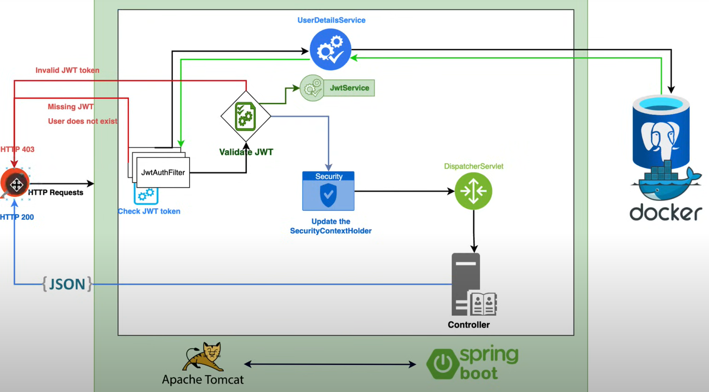
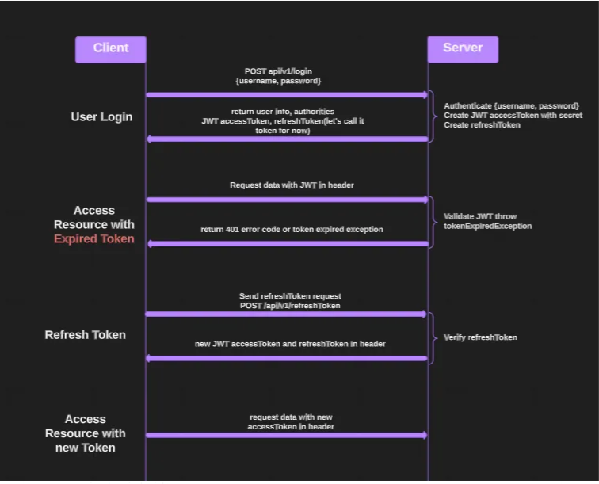
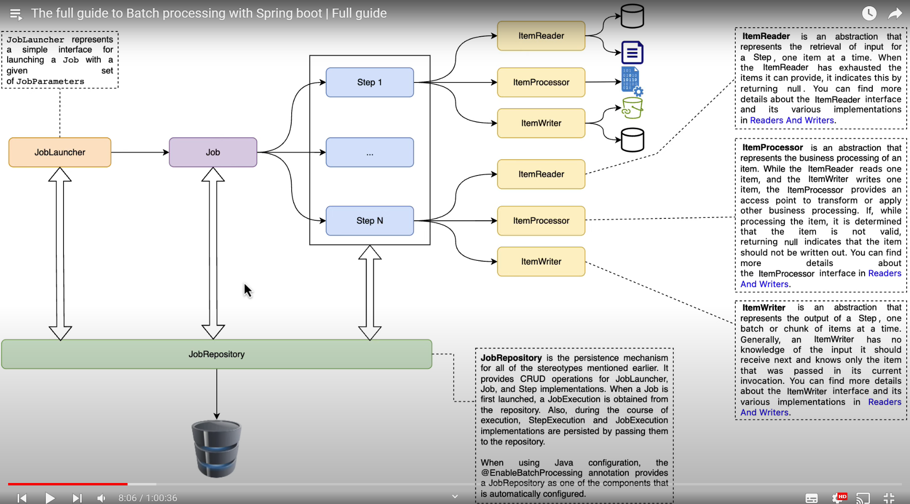
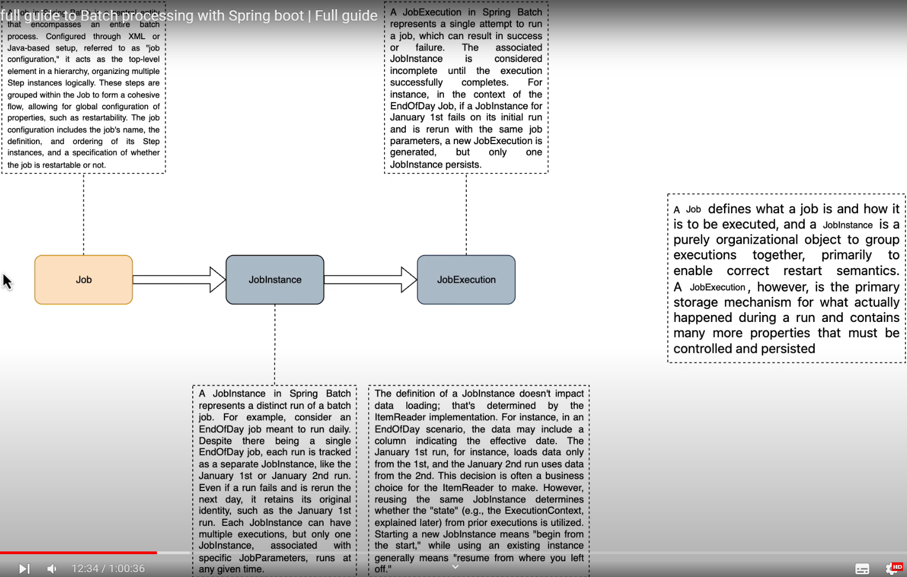
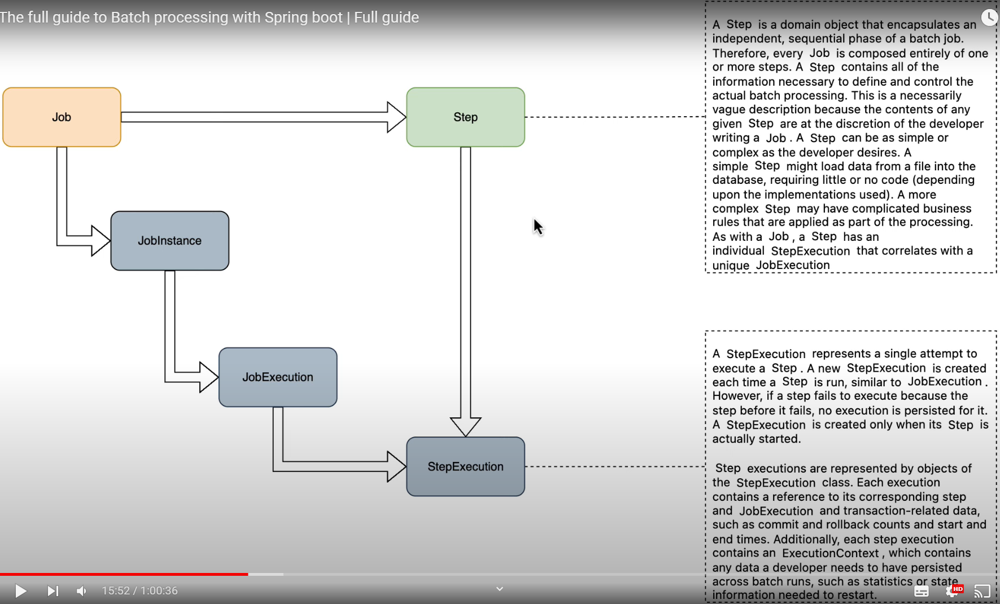

JWT Mechanism:
1. Client (Browser) invokes JwtAuthFilter
2. JwtAuthFilter intercepts the call and checks if it has JWT token or not
- 403 error in case the token is missing
3. JwtAuthFilter extracts subject from token (subject is something unique, such as email)
4. JwtAuthFilter starts validation process and calls UserDetailsService. It passes token subject
5. UserDetailsService looks for user data in the database by token subject and return data to JwtAuthFilter
6. JwtAuthFilter validates data from the database  
- if user exists in the database
- if email from jwt matches the email of the user from the database
- if token is not expired
- if token is not revoked
7. JwtAuthFilter calls SecurityContextHolder and set this connected user
- This way it says to Spring that this user is authenticated
8. SecurityContextHolder calls DispatcherServlet
9. DispatcherServlet calls controller
10. controller returns response to client (Browser)

Refresh-token Mechanism  
- It is designed exclusively for obtaining a new access token. Refresh-token has a longer lifetime than the access token  
- In fact, the refresh-token lifetime is the time after which the user will have to re-authenticate
  
  
Swagger:
http://localhost:8080/swagger-ui/index.html

Spring-Batch:  
  
  
  

APPLICATION STARTUP PREREQUISITES
1. Add the following system variables:
DOCKER_HOST=tcp://localhost:2375